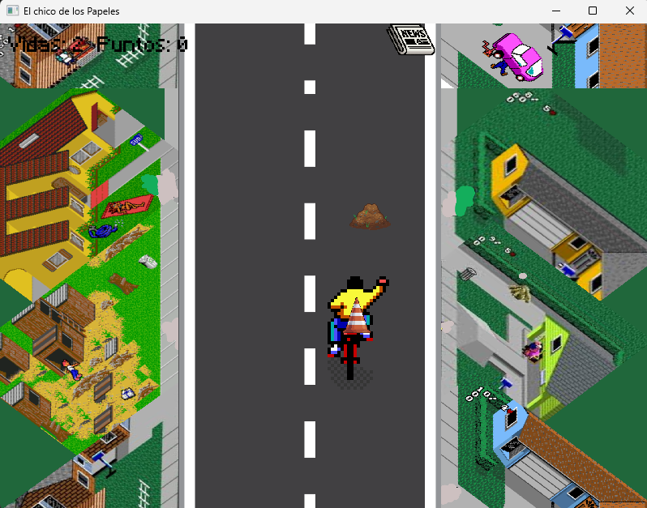
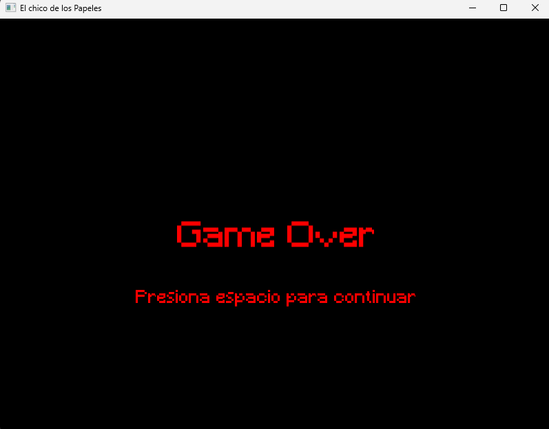

# Paperboy
proyecto de programacion avanzada basandose en el juego Paperboy

## Hecho por
>Luis Eduardo Lomeli Saavedra

>Luis Leonardo Briseño Padilla

# Ejecucion

para genera y ejecutar el codigo, escribir la siguiente instrucciòn

>make runmain

en caso de tener problemas ejecutar las siguientes instrucciones en consola
>make clean

>make runmain

# Video

Video demostrativo en caso de no visualizar instalar la extension:

El video contiene audio por lo que si no se logra escuchar ir al link:

[Enlace video](https://youtu.be/m9prUdY5cVY)

>MPEG-4 Preview

## Librerias utilizadas (Msys2)

Ejecutar los siguientes comandos en la terminal de msys2 para instalar las dependencias necesarias

### DevTools
Compiladores y herramientas necesarias para el desarrollo.

https://code.visualstudio.com/docs/makecpp/config-mingw
> pacman -S --needed base-devel mingw-w64-x86_64-toolchain

### SFML
https://packages.msys2.org/package/mingw-w64-x86_64-sfml
> pacman -S mingw-w64-x86_64-sfml

### Box2D simulaciones de fisica - C++
https://box2d.org/documentation/
https://packages.msys2.org/package/mingw-w64-x86_64-box2d?repo=mingw64
pacman -S mingw-w64-x86_64-box2d

## Complementos necesarios VSCode

- Material Icon
- C/C++
- PlantUML
- GitGraph

## Capturas

